# BEHACKER

> A safe, fully client-side lab environment for learning and practicing web security vulnerabilities. Built with pure HTML, CSS, and JavaScript — no backend, no installation, no risk.

---

## Quick Start

Open `HOME.html` in any browser. From there you can read about the project and navigate to `NAVIGATE.html` to browse and launch any of the 59 labs.

---

## Lab Structure

```mermaid
graph TD
    ROOT["🏠 HackingTarget"]

    ROOT --> CI["💉 Code Injection"]
    ROOT --> XSS["🔴 XSS"]
    ROOT --> AUTH["🔑 Authentication"]
    ROOT --> SESS["🍪 Session & Cookies"]
    ROOT --> AC["🚪 Access Control"]
    ROOT --> CS["🖱️ Client-Side"]
    ROOT --> DOS["💣 Denial of Service"]
    ROOT --> FP["📁 File & Path"]
    ROOT --> ID["🔍 Info Disclosure"]
    ROOT --> API["🔌 API Security"]
    ROOT --> CRYPTO["🔐 Cryptography"]
    ROOT --> BL["🛒 Business Logic"]
    ROOT --> SSRF["🌐 SSRF"]
    ROOT --> PP["☠️ Prototype Pollution"]
    ROOT --> WC["📦 Web Cache"]
    ROOT --> DNS["🌍 DNS & Subdomain"]
    ROOT --> SE["🎭 Social Engineering"]

    CI --> CI1["SQL Injection — Login"]
    CI --> CI2["SQL Injection — URL"]
    CI --> CI3["SQL Injection — Search"]
    CI --> CI4["HTML Injection"]
    CI --> CI5["JS Injection"]
    CI --> CI6["Command Injection"]
    CI --> CI7["SSTI"]

    XSS --> XSS1["Reflected XSS"]
    XSS --> XSS2["Stored XSS"]
    XSS --> XSS3["DOM XSS"]

    AUTH --> AUTH1["Brute Force"]
    AUTH --> AUTH2["Credential Stuffing"]
    AUTH --> AUTH3["Default Credentials"]
    AUTH --> AUTH4["Password Reset Poisoning"]

    SESS --> SESS1["Session Fixation"]
    SESS --> SESS2["Cookie Tampering"]
    SESS --> SESS3["JWT Attacks"]

    AC --> AC1["IDOR"]
    AC --> AC2["Privilege Escalation"]
    AC --> AC3["Forced Browsing"]

    CS --> CS1["Clickjacking"]
    CS --> CS2["CSRF"]
    CS --> CS3["Open Redirect"]

    DOS --> DOS1["ReDoS"]
    DOS --> DOS2["Resource Exhaustion"]

    FP --> FP1["Path Traversal"]
    FP --> FP2["File Upload Bypass"]
    FP --> FP3["XXE"]

    ID --> ID1["Directory Listing"]
    ID --> ID2["Error Leakage"]
    ID --> ID3["Source Code Exposure"]

    API --> API1["Mass Assignment"]
    API --> API2["API Key Exposure"]
    API --> API3["Rate Limit Bypass"]
    API --> API4["GraphQL Introspection"]
    API --> API5["Broken Object Auth"]

    CRYPTO --> CR1["Weak Hashing"]
    CRYPTO --> CR2["Hardcoded Secrets"]
    CRYPTO --> CR3["Insecure Randomness"]
    CRYPTO --> CR4["Padding Oracle"]

    BL --> BL1["Negative Price"]
    BL --> BL2["Coupon Stacking"]
    BL --> BL3["Workflow Skip"]
    BL --> BL4["Race Condition"]

    SSRF --> SSRF1["Basic SSRF"]
    SSRF --> SSRF2["Cloud Metadata"]
    SSRF --> SSRF3["Filter Bypass"]

    PP --> PP1["Client-Side Pollution"]
    PP --> PP2["Gadget Chain"]
    PP --> PP3["Server-Side Pollution"]

    WC --> WC1["Cache Key Manipulation"]
    WC --> WC2["Stored Poisoning"]
    WC --> WC3["Fat GET Poisoning"]

    DNS --> DNS1["Subdomain Takeover"]
    DNS --> DNS2["DNS Rebinding"]
    DNS --> DNS3["Dangling DNS"]

    SE --> SE1["Phishing Page"]
    SE --> SE2["Pretexting"]
    SE --> SE3["QR Redirect"]
```

---

## All 59 Labs

| # | Category | Lab | Folder |
|---|----------|-----|--------|
| 1 | Code Injection | SQL Injection — Login bypass | `Codeinjection/SQL/login/` |
| 2 | Code Injection | SQL Injection — URL parameter | `Codeinjection/SQL/url/` |
| 3 | Code Injection | SQL Injection — Search box | `Codeinjection/SQL/search/` |
| 4 | Code Injection | HTML Injection | `Codeinjection/Other/html/` |
| 5 | Code Injection | JS Injection | `Codeinjection/Other/js/` |
| 6 | Code Injection | Command Injection | `Codeinjection/Other/command/` |
| 7 | Code Injection | SSTI | `Codeinjection/Other/ssti/` |
| 8 | XSS | Reflected XSS | `XSS/reflected/` |
| 9 | XSS | Stored XSS | `XSS/stored/` |
| 10 | XSS | DOM XSS | `XSS/dom/` |
| 11 | Authentication | Brute Force | `Authentication/bruteforce/` |
| 12 | Authentication | Credential Stuffing | `Authentication/credential-stuffing/` |
| 13 | Authentication | Default Credentials | `Authentication/default-credentials/` |
| 14 | Authentication | Password Reset Poisoning | `Authentication/password-reset/` |
| 15 | Session | Session Fixation | `Session/fixation/` |
| 16 | Session | Cookie Tampering | `Session/cookie-tampering/` |
| 17 | Session | JWT Attacks | `Session/jwt/` |
| 18 | Access Control | IDOR | `AccessControl/idor/` |
| 19 | Access Control | Privilege Escalation | `AccessControl/privilege-escalation/` |
| 20 | Access Control | Forced Browsing | `AccessControl/forced-browsing/` |
| 21 | Client-Side | Clickjacking | `ClientSide/clickjacking/` |
| 22 | Client-Side | CSRF | `ClientSide/csrf/` |
| 23 | Client-Side | Open Redirect | `ClientSide/open-redirect/` |
| 24 | DoS | ReDoS | `DoS/redos/` |
| 25 | DoS | Resource Exhaustion | `DoS/resource-exhaustion/` |
| 26 | File & Path | Path Traversal | `FileAndPath/path-traversal/` |
| 27 | File & Path | File Upload Bypass | `FileAndPath/file-upload/` |
| 28 | File & Path | XXE | `FileAndPath/xxe/` |
| 29 | Info Disclosure | Directory Listing | `InformationDisclosure/directory-listing/` |
| 30 | Info Disclosure | Error Leakage | `InformationDisclosure/error-leakage/` |
| 31 | Info Disclosure | Source Code Exposure | `InformationDisclosure/source-code-exposure/` |
| 32 | API Security | Mass Assignment | `API/mass-assignment/` |
| 33 | API Security | API Key Exposure | `API/api-key-exposure/` |
| 34 | API Security | Rate Limit Bypass | `API/rate-limit-bypass/` |
| 35 | API Security | GraphQL Introspection | `API/graphql-introspection/` |
| 36 | API Security | Broken Object Auth | `API/broken-object-auth/` |
| 37 | Cryptography | Weak Hashing | `Crypto/weak-hashing/` |
| 38 | Cryptography | Hardcoded Secrets | `Crypto/hardcoded-secrets/` |
| 39 | Cryptography | Insecure Randomness | `Crypto/insecure-randomness/` |
| 40 | Cryptography | Padding Oracle | `Crypto/padding-oracle/` |
| 41 | Business Logic | Negative Price | `BusinessLogic/negative-price/` |
| 42 | Business Logic | Coupon Stacking | `BusinessLogic/coupon-stacking/` |
| 43 | Business Logic | Workflow Skip | `BusinessLogic/workflow-skip/` |
| 44 | Business Logic | Race Condition | `BusinessLogic/race-condition/` |
| 45 | SSRF | Basic SSRF | `SSRF/basic-ssrf/` |
| 46 | SSRF | Cloud Metadata | `SSRF/cloud-metadata/` |
| 47 | SSRF | Filter Bypass | `SSRF/filter-bypass/` |
| 48 | Prototype Pollution | Client-Side | `PrototypePollution/client-side/` |
| 49 | Prototype Pollution | Gadget Chain | `PrototypePollution/gadget-chain/` |
| 50 | Prototype Pollution | Server-Side | `PrototypePollution/server-side/` |
| 51 | Web Cache | Cache Key Manipulation | `WebCache/cache-key-manipulation/` |
| 52 | Web Cache | Stored Poisoning | `WebCache/stored-poisoning/` |
| 53 | Web Cache | Fat GET Poisoning | `WebCache/fat-get-poisoning/` |
| 54 | DNS & Subdomain | Subdomain Takeover | `DNS/subdomain-takeover/` |
| 55 | DNS & Subdomain | DNS Rebinding | `DNS/dns-rebinding/` |
| 56 | DNS & Subdomain | Dangling DNS | `DNS/dangling-dns/` |
| 57 | Social Engineering | Phishing Page | `SocialEngineering/phishing/` |
| 58 | Social Engineering | Pretexting | `SocialEngineering/pretexting/` |
| 59 | Social Engineering | QR Redirect | `SocialEngineering/qr-redirect/` |

---

## Design System

All labs share a consistent dark GitHub-inspired theme:

| Token | Value | Use |
|-------|-------|-----|
| Background | `#0d0f14` | Page background |
| Card | `#161b22` | Lab card surface |
| Border | `#30363d` | All borders |
| Text | `#c9d1d9` | Body text |
| Accent blue | `#58a6ff` | Links, focus rings |
| Code yellow | `#f8c555` | Code, labels |
| Success green | `#238636` | Buttons, success states |
| Error red | `#b91c1c` | Lab banner, error states |
| Terminal green | `#b5e8a0` | Terminal output |

Each lab contains:
- `index.html` — interactive lab UI
- `style.css` — lab-specific styles
- `script.js` — simulation logic
- `explaining.html` — vulnerability explanation with code examples

---

## Ethics

All simulations are purely educational and run entirely in the browser. No real servers, no real exploits, no real data at risk.
